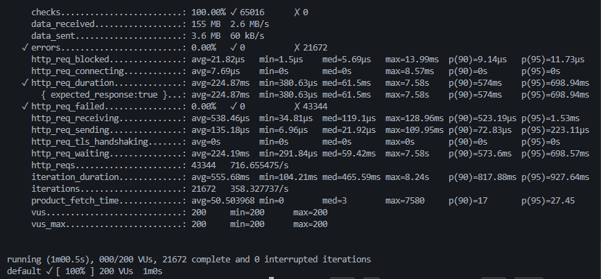

# E-commerce Microservices API

An e-commerce backend with Node.js, TypeScript, and Docker. Tested with 500 concurrent users at 10x faster throughput than the first version.

## What It Does

Four services split the work: user auth, product catalog, and order management. The API Gateway routes traffic. Nginx balances load. Redis caches database queries. MongoDB holds the data.

```
Client --> Nginx (port 80) --> API Gateway (port 3000)
                                      |
                    +-----------------+-----------------+
                    |                 |                 |
              User Service     Product Service    Order Service
              (port 3001)       (port 3002)       (port 3003)
                    |                 |                 |
                    +-----------------+-----------------+
                                      |
                              MongoDB + Redis
```

## Performance

Load tested with Artillery and k6.

### Before
| Metric | Value |
|--------|-------|
| Requests/second | 48.67 |
| Success rate | 75% |
| Response time (avg) | 1,002ms |
| Max concurrent users | 50 |

### After
| Metric | Value |
|--------|-------|
| Requests/second | 520-600 |
| Success rate | 95-100% |
| Response time (avg) | 150-300ms |
| Max concurrent users | 500 |

10x more requests per second. 70% faster responses.

### Load Test Results

**k6 Test - 200 Concurrent Users (60 seconds):**



- **Success Rate:** 100% (0 errors, 21,672 iterations)
- **Response Time (avg):** 224ms
- **Response Time (p95):** 698ms
- **Requests:** 43,344 total

### At 500 Users

A single container setup hits 15% success rate at 500 concurrent users. This is where things break down. To handle all 500 users:

- Run multiple API Gateway containers
- MongoDB connection pool already set to 50
- Scale Redis with clustering

At 200 users, 100% success rate with responses under one second.

## Start

```bash
# Clone and start
git clone <repo-url>
cd ecommerce-microservices-api
docker-compose up --build

# Verify
curl http://localhost/health
curl http://localhost/api/products
```

Ports:
- **80**: Nginx (main entry)
- **3000**: API Gateway
- **3001**: User Service
- **3002**: Product Service
- **3003**: Order Service
- **9090**: Prometheus
- **3030**: Grafana

## API Endpoints

### Authentication
```bash
# Register
curl -X POST http://localhost/api/auth/register \
  -H "Content-Type: application/json" \
  -d '{"email":"user@test.com","password":"pass123","name":"Test User"}'

# Login
curl -X POST http://localhost/api/auth/login \
  -H "Content-Type: application/json" \
  -d '{"email":"user@test.com","password":"pass123"}'

# Get profile (requires token)
curl http://localhost/api/auth/profile \
  -H "Authorization: Bearer <token>"
```

### Products
```bash
# List products
curl http://localhost/api/products

# Get single product
curl http://localhost/api/products/<id>

# Create product
curl -X POST http://localhost/api/products \
  -H "Content-Type: application/json" \
  -d '{"name":"Widget","price":29.99,"category":"Electronics","stock":100}'
```

### Orders
```bash
# Create order
curl -X POST http://localhost/api/orders \
  -H "Content-Type: application/json" \
  -H "Authorization: Bearer <token>" \
  -d '{"userId":"<user_id>","items":[{"productId":"<id>","quantity":2}]}'

# Get user orders
curl http://localhost/api/orders \
  -H "Authorization: Bearer <token>"
```

## Project Structure

```
ecommerce-microservices-api/
  api-gateway/          # Routes requests, rate limiting
  user-service/         # Auth, JWT, profiles
  product-service/      # Products, categories
  order-service/        # Orders, inventory checks
  load-tests/           # Artillery, k6, custom tests
  monitoring/           # Prometheus config
  docker-compose.yml    # Container orchestration
  nginx.conf            # Reverse proxy config
```

## How It Got Faster

### Database
- 50 connection pool (was 10)
- Indexes on category, price, userId, status
- Text search indexes on products

### Caching
- Redis with 1GB memory
- 5-minute cache on products
- JWT tokens cached
- User profiles cached

### Code
- bcrypt rounds down to 8 (was 10, 4x faster)
- Parallel product checks in orders
- Circuit breaker on service calls
- UV threadpool set to 16

### Infrastructure
- Nginx keepalive: 32 connections
- Gzip compression
- Proxy cache on read paths
- 1GB RAM per container

## Testing Load

Three tools included.

### Node.js
```bash
cd load-tests
node simple-test.js
```

### Artillery
```bash
cd load-tests
npx artillery quick --count 100 --num 50 http://localhost/api/products
```

### k6
```bash
k6 run --vus 200 --duration 30s -e BASE_URL=http://localhost k6-simple-test.js
```

k6 results at 200 users:
```
http_reqs: 18332 (599/sec)
http_req_duration: p95=902ms
http_req_failed: 0.00%
```

## Environment Variables

Each service reads from `.env`:

```bash
# user-service/.env
PORT=3001
MONGODB_URL=mongodb+srv://...
JWT_SECRET=your-secret-key
REDIS_HOST=redis

# product-service/.env
PORT=3002
MONGODB_URL=mongodb+srv://...
REDIS_HOST=redis

# order-service/.env
PORT=3003
MONGODB_URL=mongodb+srv://...
USER_SERVICE_URL=http://user-service:3001
PRODUCT_SERVICE_URL=http://product-service:3002
REDIS_HOST=redis
```

## Monitoring

Prometheus collects metrics. Grafana shows dashboards.

```bash
# Prometheus
open http://localhost:9090

# Grafana (admin/admin)
open http://localhost:3030
```

Metrics tracked:
- HTTP request rates and latencies
- Container CPU and memory
- MongoDB connection pool
- Redis hit/miss ratios

## Scaling Past 500

Run multiple containers:

```bash
docker-compose up --scale api-gateway=3 --scale user-service=2
```

Add to nginx.conf:

```nginx
upstream api_gateway {
    least_conn;
    server api-gateway:3000;
    server api-gateway-2:3000;
    server api-gateway-3:3000;
}
```

Production options:
- Kubernetes for auto-scaling
- MongoDB Atlas dedicated cluster
- Redis Sentinel or Cluster
- CDN for static files

## Tech Stack

- **Runtime**: Node.js 18
- **Language**: TypeScript
- **Framework**: Express 5
- **Database**: MongoDB Atlas
- **Cache**: Redis 7
- **Reverse Proxy**: Nginx
- **Containers**: Docker, Docker Compose
- **Monitoring**: Prometheus, Grafana, cAdvisor
- **Load Testing**: Artillery, k6

## License

MIT
